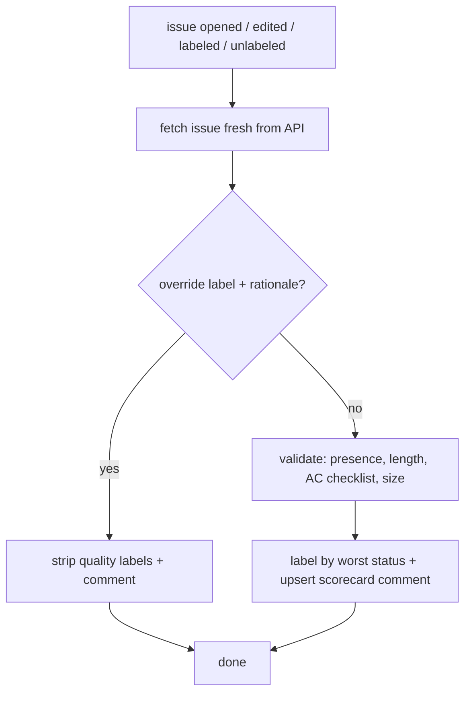

# issue-quality-gate

A deterministic quality gate for GitHub issues, so they are reliable input for
autonomous coding agents. Structural checks only — presence, length, checklist
count, size enum. No LLM judgment.

## Features

- **Deterministic checks** — presence, min/max length, acceptance-criteria
  checklist count, size enum. Same rules every time.
- **Scorecard comment** — every run upserts one **Issue Quality Checklist** with
  a ✅ / ⚠️ / ❌ line per check, so a clean issue gets confirmation, not silence.
- **Three mutually-exclusive labels** — `issue-quality:failing` (hard block),
  `issue-quality:warning` (non-blocking), `issue-quality:pass` — a filterable
  signal for downstream automation.
- **Manual override** — a labelled escape hatch with a required written rationale.
- **One-command opt-in** — `npx github:orestes-dev/issue-quality-gate init` drops
  the Issue Form + workflow; no per-repo config.
- **Shared pre-flight validator** — agents run the same checks locally before
  `gh issue create`.

## What it checks

| Field | Rule | Severity |
| --- | --- | --- |
| **Context** | present, ≥ 30 chars | error |
| **Context** | ≤ 1500 chars | warning (fluff detector) |
| **Acceptance Criteria** | ≥ 1 non-empty checklist item (`- [ ]`) | error |
| **Out of Scope** | present, ≥ 10 chars | error |
| **Size** | one of `XS / S / M / L / XL` | error |
| **Size** | not `L` / `XL` (too big for one agent run) | error |

The worst per-check status sets one mutually-exclusive label:

| Outcome | Label |
| --- | --- |
| ≥ 1 error | `issue-quality:failing` |
| 0 errors, ≥ 1 warning | `issue-quality:warning` |
| clean | `issue-quality:pass` |

Every run upserts the scorecard comment (removed only by a completed override):

```md
### Issue Quality Checklist

- ✅ **Context**: present (118 chars)
- ✅ **Acceptance Criteria**: 2 checklist items
- ❌ **Out of Scope**: missing or empty
- ✅ **Size**: S
```

### Override

Set `override:issue-quality` **and** add a non-empty `## Override rationale`
section to bypass: all quality labels and the comment are stripped. The label
without a rationale does not bypass; it raises a warning to write one.

## Opting a repo in

```sh
npx github:orestes-dev/issue-quality-gate init
```

Run from the repo root. This drops two files, which together are the opt-in:

- `.github/ISSUE_TEMPLATE/task.yml` — the Issue Form (canonical schema).
- `.github/workflows/issue-quality.yml` — a thin workflow calling the shared
  Action at `@main`.

Commit both. CI runs on `issues: opened` / `edited` always, and on `labeled` /
`unlabeled` only when a human touches `override:issue-quality` or an
`issue-quality:*` label. The gate's own label writes (as the CI bot) are
excluded, so it never re-triggers itself; a human hand-editing a quality label
re-runs it, so manual changes self-heal.

Blank or freeform issues (any `gh issue create` body) skip the form and land as
`issue-quality:failing`, so nothing bypasses the gate. To stop blank issues
entirely, add `.github/ISSUE_TEMPLATE/config.yml` with
`blank_issues_enabled: false` yourself.

The gate labels issues going forward, from the first event on each. To label the
existing backlog too, run [`sweep`](#backfilling-the-backlog) once after opting
in.

## Backfilling the backlog

Opt-in is going-forward only: an existing issue is validated the next time it is
edited, so an untouched backlog stays unlabeled. To backfill on demand, run:

```sh
npx github:orestes-dev/issue-quality-gate sweep
```

`sweep` labels + scorecards every **open** issue that has no `issue-quality:*`
label yet, running each through the same gate the CI action does. It takes no
flags: it reads credentials from `gh auth token` and the target repo from
`gh repo view`, so run it inside an authenticated clone of the repo.

- **Idempotent and re-runnable.** Already-labeled issues are filtered out server
  side, so they are never touched or re-notified; only unlabeled issues are
  swept. Re-running only picks up new arrivals.
- **Resilient.** A failure on one issue is reported and the sweep continues; the
  run exits non-zero if any issue failed, so you can re-run to retry just those.
- **Backlogs over 1000.** GitHub caps issue search at 1000 results. Because
  sweeping labels an issue (dropping it from the query), `sweep` prints a notice
  when more remain — re-run until it stops.

Labels are created on first use with intentional colors and descriptions, so
`sweep` (or the first CI run) also materializes the three `issue-quality:*`
labels in the repo; there is no separate label-setup step.

## Pre-flight validation

Before `gh issue create`, run the same validator on a draft file:

```sh
npx github:orestes-dev/issue-quality-gate validate path/to/issue-body.md
```

The file must use the same `### ` headings the Issue Form renders:

```md
### Context

<what needs to happen and why>

### Acceptance Criteria

- [ ] <verifiable outcome>

### Out of Scope

- <explicit non-goal>

### Size

S
```

Exits non-zero on errors. One validator backs both CI and pre-flight.

## Flow



## Notes

- **`@main`, unpinned.** Consumers reference `orestes-dev/issue-quality-gate@main`,
  so rule changes propagate on the next run with no per-repo bump — accepting
  that a bad change affects every opted-in repo at once.
- **Fixed schema.** No per-repo config or inputs, so the labels mean the same
  thing in every repo.
- **Going-forward only.** Opt-in does not auto-backfill; existing issues are
  validated when next edited. Run [`sweep`](#backfilling-the-backlog) to label
  the current backlog on demand.

## Architecture

- `src/schema.js` — single source of truth for fields, limits, labels, statuses.
- `src/validator.js` — pure, dependency-free, regex-free parse + validate;
  returns a per-check scorecard (`{ checks, size }`).
- `src/report.js` — renders the scorecard as the bot comment and CLI output.
- `src/action.js` — CI entry: reconciles labels, upserts the scorecard comment.
- `src/sweep.js` — backfill: searches a repo's unlabeled open issues and runs
  each through the same `action.js` gate core.
- `src/github.js` — zero-dependency REST client (labels, comments, search).
- `bin/cli.js` — `init`, `validate`, and `sweep` commands.
- `action.yml` — composite Action consumed by opted-in repos.

Node.js ≥ 18 on the CI runner and locally. The Action calls the runner's ambient
`node` (no `setup-node`), which `ubuntu-latest` ships; a self-hosted runner needs
a compatible `node` on `PATH`.
